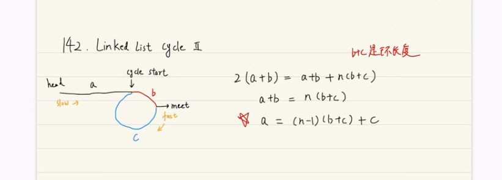

## [环形链表II](<https://leetcode-cn.com/problems/linked-list-cycle-ii/>)

### 题目

给定一个链表，返回链表开始入环的第一个节点。如果链表无环，则返回`null`。

为了表示给定链表中的环，我们使用整数`pos`来表示链表尾部连接到链表中的位置(索引从0开始)。如果`pos`是`-1`，则在该链表中没有环。

**说明：**不允许修改给定的链表

**示例1：**

~~~
输入：head = [3,2,0,-1], pos = 1
输出：tail connects to node index 1
解释：链表中有一个环，其尾部连接到第二个节点。
~~~

**示例2：**

~~~
输入：head = [1,2], pos = 0
输出：tail connects to node index 0
解释：链表中有一个环，其尾部连接到第一个节点。
~~~

**示例3：**

~~~
输入：head = [1], pos = -1
输出：no cycle
解释：链表中没有环。
~~~

**进阶：**

你是否可以不用额外空间解决此题？

### 思路

快慢指针判断链表中是否有环

快慢指针相遇的点开始，快指针向后每次移动一步，慢指针从链表头开始每次向后移动一步

快慢指针再次相遇的点，即为环的起始点

### 参考

[【LeetCode训练营】(链表)142. Linked List Cycle II](<https://www.bilibili.com/video/av48348861?from=search&seid=5212317304831117096>)